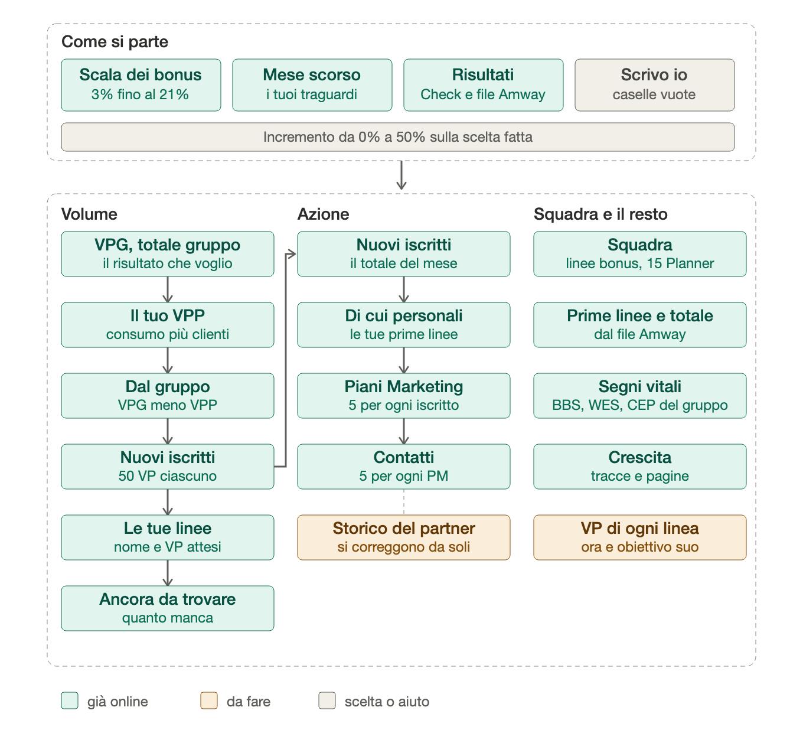
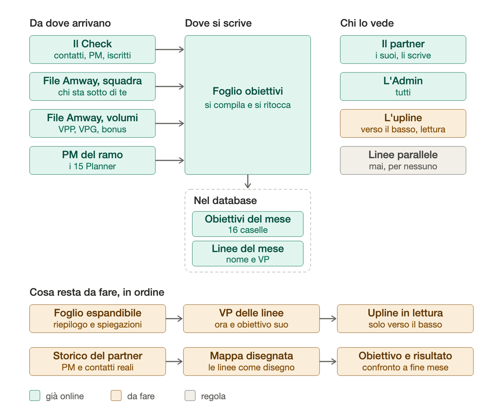

# Obiettivi del mese: schema completo

Fatto con Ignazio il 01/10/2026. Nessun dato personale: è lo schema di come funziona il foglio, da dove arrivano i numeri, chi può vederli e cosa resta da fare. Lo stato preciso del codice sta in `STRUTTURA.md`; i lavori in MB Project → Dashboard.

## 1. Il foglio

- **Come si parte:** scala dei bonus (3% … 21%, sempre in vista, con un consiglio da dove cominciare), obiettivi del mese scorso, risultati (Check + file Amway), «Scrivo io». L'incremento (0 … 50%) vale sulla scelta fatta.
- **Volume:** VPG (il risultato che si vuole) → il tuo VPP (consumo + VP Clienti) → «dal gruppo» (VPG meno VPP) → nuovi iscritti da 50 VP l'uno → le tue linee (nome e VP attesi) → quanto resta da trovare.
- **Azione:** nuovi iscritti → di cui personali → Piani Marketing (5 per iscritto) → contatti (5 per PM). Sono valori di partenza uguali per tutti.
- **Squadra e il resto:** linee riceventi Bonus, 15 Planner, prime linee, totale gruppo; BBS, WES e CEP del gruppo; tracce e pagine.

## 2. Dati, permessi, prossimi passi

**Regola di visibilità (Ignazio 01/10):** chi sta sopra vede gli obiettivi di chi sta sotto di lui nella sua stessa linea, **solo in lettura**, e **mai le linee parallele**. Si controlla sulla mappa ufficiale (file Amway, `squadra`) e va fatta rispettare nel database, non solo a schermo. Serve per aiutare il partner e per adeguare i propri obiettivi.

## 3. Cosa resta da fare, in ordine

1. Foglio unico espandibile: riepilogo in cima, gruppi che si aprono e chiudono, una breve spiegazione per gruppo.
2. VP delle linee: «ora» (volumi del mese in corso) e, con la lettura per l'upline, l'obiettivo che la linea si è data.
3. Upline in lettura, solo verso il basso.
4. Rapporti contatti → PM → iscritti che si correggono da soli con lo storico del partner (base: 5 e 5).
5. Mappa disegnata delle linee.
6. Confronto obiettivo contro risultato a fine mese.

I file `schemi/*.svg` sono i sorgenti (si aprono in qualsiasi browser); i `.png` sono le stesse immagini.
